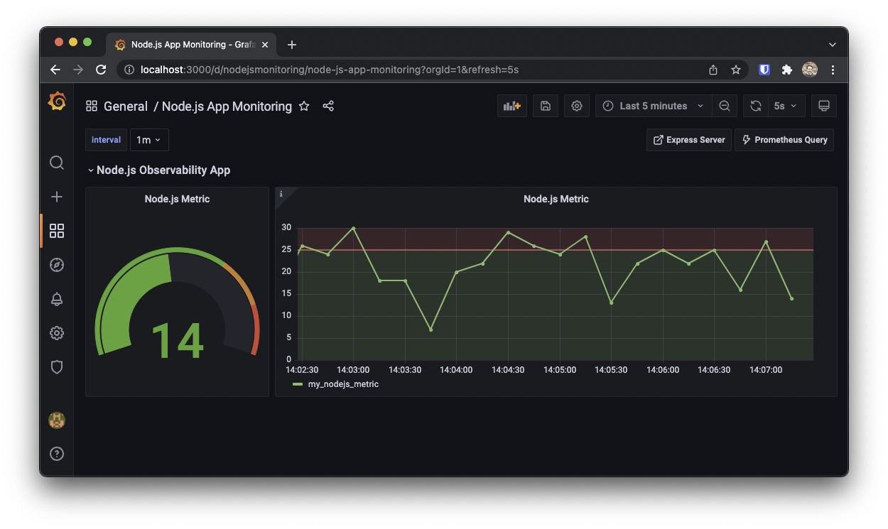
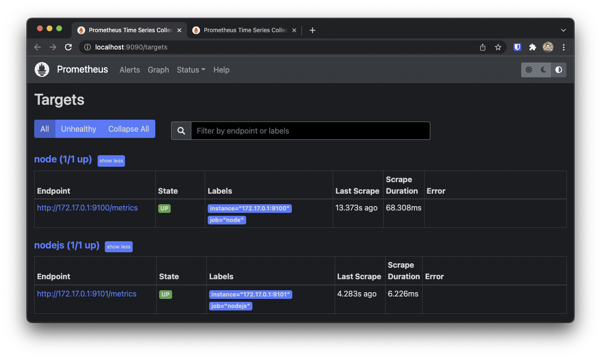
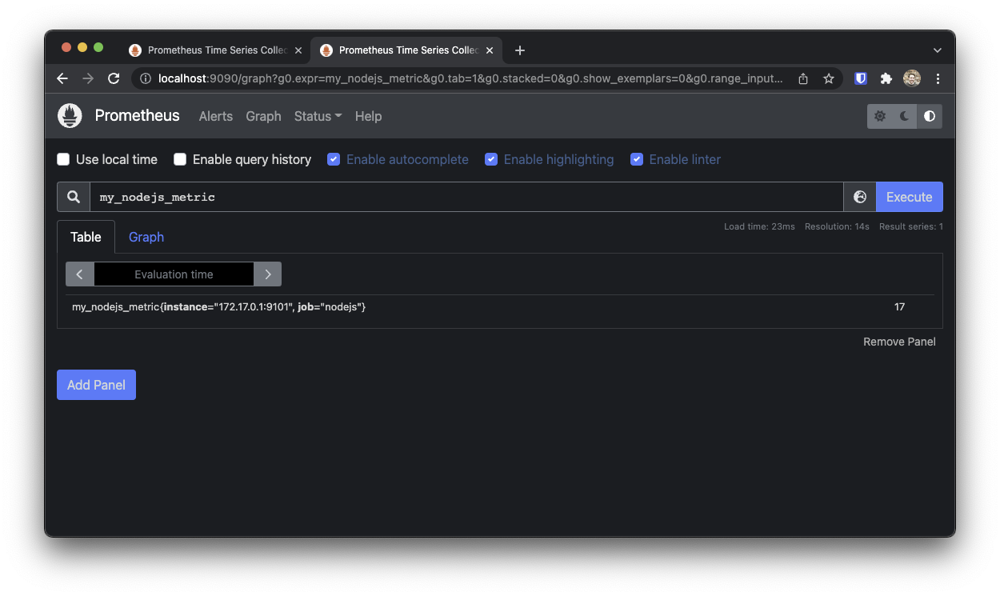

# Observability Demo



## Usage

Clone this repo:
```
git clone https://github.com/tkav/observability-demo
cd observability-demo
```

Run using docker-compose:
```
docker-compose up -d
```

This will start the following services:

| Service           | URL                           |
|---------------    |-----------------------        |
| Grafana           | http://localhost:3000         |
| Prometheus        | http://localhost:9090         |
| node-exporter     | http://localhost:9100/metrics |
| observability-app | http://localhost:9101/metrics |


## Grafana

Log into [Grafana](http://localhost:3000) with `admin/admin`. Set a new password or click `Skip`.

Grafana is auto-provisioned with a Prometheus datasource (`provisioning/datasources/prometheus.yml`) and dashboards (`provisioning/dashboards/*.json`).

If you make changes to `prometheus.yml`, or want to rebuild Grafana with new provisions, run:
```
docker-compose up -d --build --force-recreate
```


## Observability App

The observability-app (`node-app`) is a node.js app (express server) that publishes a random integer between 5 and 30 called `my_nodejs_metric` at http://localhost:9101/metrics.

```js
app.get('/metrics', function (req, res) {
    var value = randomInt(5,30)
    res.send('my_nodejs_metric '+value)
})
```

The app is setup as a target in Prometheus (http://localhost:9090/targets):



Prometheus scrapes this endpoint, allowing the [`my_nodejs_metric`](http://localhost:9090/graph?g0.expr=my_nodejs_metric&g0.tab=1&g0.stacked=0&g0.show_exemplars=0&g0.range_input=1h) value to be visible in Grafana.
```
curl http://localhost:9101/metrics
```




There is a [Node.js App Monitoring Dashboard](http://localhost:3000/d/nodejsmonitoring/node-js-app-monitoring?orgId=1&refresh=5s) configured in Grafana:


Here you can view the metric from the node.js app and Prometheus.
In this example there is a upper threshold of 25. Values above this are shown red.


